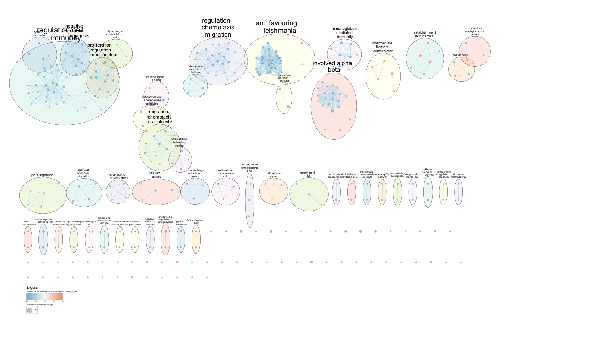
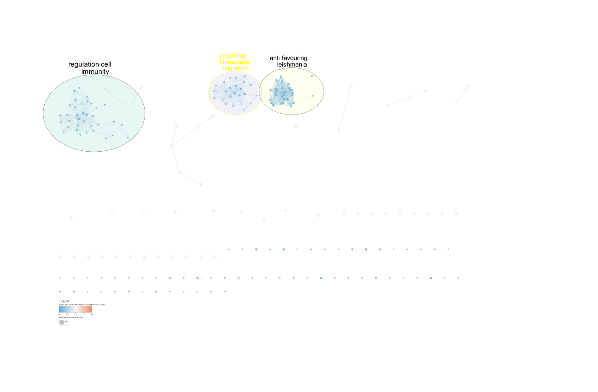

## Introduction

In their 2024 study, Liu and colleagues focused on a type of lung cancer called
lung adenocarcinoma (LUAD), which is one of the most common and deadliest forms
of cancer globally[@zappa2016non]. Even after doctors surgically remove the
tumor, this cancer often spreads to other parts of the body in about half of the
patientsr[@liu2024modeling]. To better understand and find ways to treat this
spread, called metastasis, they developed a new experimental model using
patient-derived organoids (PDOs). PDOs are three-dimensional cell cultures taken
from patients' tumors that act like the actual biological environment of lung
cancer. The study also used metastasis-derived organoids (MDOs), taken from
different places where the cancer spread, like the brain, diaphragm, liver, and
gallbladder, to study and find out more about what causes LUAD to spread and
possible ways to treat it.

## Previous Work

For this project, the RNA sequencing data used came from three different groups:
patient-derived organoids (PDO), metastasis-derived organoids (MDO), and control
group human tumor samples. This data was obtained from the Lung Adenocarcinoma
[(LUAD)](https://pubmed.ncbi.nlm.nih.gov/39413736/) study, which is documented
and accessible under the GEO accession number
[GSE276387](https://www.ncbi.nlm.nih.gov/geo/query/acc.cgi?acc=GSE276387).

### A1

In A1, the orginal `57445` data set was pre-processed and the genes were mapped
to HUGO Gene Nomenclature Committee (HGNC) symbols. Missing values and
duplicated genes were removed to ensure data integrity. Outliers were identified
and removed to enhance the robustness of the analysis. Finally the Trimmed Mean
of M-values (TMM) method was employed for normalization to minimize technical
variance.

The final resulting data set has `17195` genes over `14` samples (5 Patient
Derived Organoid samples, 5 Metastasis Derived Organoid samples, and 4 Human
Tumor Samples).

### A2

#### Differential Gene Expression

In A2, a quasi-likelihood model built into `edgeR` which is advantageous in
RNA-seq data analysis due to its strength in handling overdispersed count data,
and a FDR-corrected p value of `0.05` were used. The data revealed `332`
significantly differentially expressed genes between Tumor and MDO samples, and
`631` between Tumor and PDO samples, indicating more pronounced differences in
gene expression profiles between the tumor and PDO samples than between the
tumor and MDO samples. This suggests that PDOs may retain more of the distinct
cellular characteristics of the original tumors compared to MDOs, possibly due
to differences in the primary and metastatic tumor environments. Despite
numerous significant differences, no genes passed the `False Discovery Rate`
correction using the `Benjamini-Hochberg` method, highlighting the challenges of
managing multiple hypothesis testing in high-throughput data analysis.

#### Thresholded over-representation analysis

Then `g:Profiler` to analyze gene sets from differentially expressed genes in
MDO and PDO. For this analysis, gene sets were categorized into up-regulated,
down-regulated, and all genes to capture the complete spectrum of gene
expression changes.The annotation sources utilized included `GO:BP` for
biological processes, `KEGG` for metabolic and signaling pathways, `REAC` for
comprehensive pathway interactions, and `WP` for the latest pathway information.

For **MDO**, `2855` upregulated and `3058` downregulated gene sets were
identified, with a total of `4507` gene sets across all genes.

For **PDO**, there were
`4533 upregulated,`3966`downregulated genes, and a total of`6266\` gene sets
across all genes.

Upon filtering for gene sets containing between `5` to `500` genes, the enriched
pathways provided insights into the cellular functions most impacted by gene
expression changes:

In **MDO**, the top upregulated pathways included **T-cell activation** and
**proliferation**, indicating an immune response component, whereas
downregulated pathways highlighted deficiencies in **DNA repair** and **cell
cycle regulation**.

In **PDO**, top pathways for upregulated genes focused on **epidermis
development** and **differentiation**, which might reflect the tissue-specific
origins and adaptations of these organoids. The top pathways for downregulated
genes included smooth muscle **cell differentiation** and various **signaling
pathways** like BMP and MAP kinase.

## Load Libraries

```{r message = FALSE, warning=FALSE}

if (! requireNamespace("kableExtra", quietly = TRUE)) {
  install.packages("kableExtra")
}

if (! requireNamespace("ComplexHeatmap", quietly = TRUE)) {
  BiocManager::install("ComplexHeatmap")
}

if (! requireNamespace("circlize", quietly = TRUE)) {
  BiocManager::install("circlize")
}

#install required R and bioconductor packages for GSEA
tryCatch(expr = { library("RCurl")}, 
         error = function(e) {  
           install.packages("RCurl")}, 
         finally = library("RCurl"))

library(ggplot2)
library(knitr)
library(kableExtra)
library(dplyr)
library(GEOquery)

# wraps lines that are too long
knitr::opts_chunk$set(tidy.opts=list(width.cutoff=80), tidy=TRUE)
# set default behaviors for all chunks
knitr::opts_chunk$set(warning = FALSE, message = FALSE)
```

## Load data

In this assignment, we’ll start with the result from the comparison between
Tumor and PDO (Patient-Derived Organoids),which had **631** genes that are
significantly differentially expressed. It will be loaded it as an `.rds` file.
The `qlf_PDO_hits.rds` file can be generated by running saveRDS(qlf_PDO_hits,
'qlf_PDO_hits.rds') after running all code chunks in A2

```{r, message=FALSE, warning=FALSE}
# Render notebook 2
rmarkdown::render("../A2/A2_KZ.Rmd")

saveRDS(qlf_PDO_hits, 'qlf_PDO_hits.rds')


# load the output of the exact test model from Assignment 2
PDO_hits <- readRDS("qlf_PDO_hits.rds")
PDO_output <- PDO_hits$table


# Calculate the 'rank' for each entry in the PDO_output data frame
# 'rank' is computed as the negative log base 10 of the PValue multiplied by the sign of the logFC (log Fold Change)
# Transforms the P-value into a more interpretable scale and combines it with the direction of change (up or down)
PDO_output[, "rank"] <- -log(PDO_output$PValue, base = 10) * sign(PDO_output$logFC)

# Sort the PDO_output data frame by the 'rank' column in ascending order
# Place the most negatively significant results (significant downregulation) at the top
# and the most positively significant results (significant upregulation) at the bottom
PDO_output <- PDO_output[order(PDO_output$rank), ]

```

## Non-thresholded Gene set Enrichment Analysis

In Assignment 2, we utilized thresholded over-representation analysis (ORA) to
explore the LUAD dataset. However, ORA has notable limitations. Firstly, the
choice of threshold is subjective, leading to variability in results depending
on the threshold set. Different thresholds can significantly alter the analysis
outcome, making the selection process somewhat arbitrary. Secondly, ORA has a
tendency to overlook subtler signals within the data. This occurs because the
method excludes data points that do not meet the predefined threshold,
potentially missing important but less pronounced trends or patterns.

To address these drawbacks, for this assignment, the Gene Set Enrichment
Analysis (GSEA) will be performed. GSEA offers a more nuanced approach by
analyzing data without the need for arbitrary threshold settings. This method
allows for the inclusion of all gene sets in the analysis, enhancing our ability
to detect both strong and weak signals across the dataset. Through GSEA, we aim
to gain a comprehensive understanding of the enrichment patterns within our
data, ensuring that no significant patterns are overlooked due to thresholding
constraints.

There are two important steps for the GSEA analysis. Firstly, a rank file should
be created, which serves as the foundation for the analysis:

```{r}
# Create a rank file (.rnk) for GSEA
rnk <- data.frame(rownames(PDO_output), PDO_output$rank)
colnames(rnk) <- c("GeneName", "rank")
write.table(rnk, file = "./Tumour_vs_PDO.rnk", sep = "\t", col.name = TRUE, row.names = FALSE,
    quote = FALSE)
```

Secondly, a pathway definition file, commonly in the GMT (Gene Matrix
Transposed) format, is required. This file compiles curated gene sets
representing various biological pathways, processes, or other functional
groupings:

```{r}
# Load GSEA related variables
gsea_jar = "~/projects/A3/GSEA_4.3.3/gsea-cli.sh"
working_dir = "~/projects/A3"
output_dir = "~/projects/A3"
analysis_name = "Tumour_vs_PDO"
rnk_file = "Tumour_vs_PDO.rnk"
dest_gmt_file = ""
```

```{r}
# Download the latest pathway definition file from BaderLab released on March 1st, 2025. (As of April 2nd, 2025)
if(dest_gmt_file == ""){
  gmt_url = "http://download.baderlab.org/EM_Genesets/current_release/Human/symbol/"
  
  #list all the files on the server
  filenames = getURL(gmt_url)
  tc = textConnection(filenames)
  contents = readLines(tc)
  close(tc)
  
  #get the gmt that has all the pathways and does not include terms 
  # inferred from electronic annotations(IEA)
  #start with gmt file that has pathways only and GO Biological Process only.
  rx = gregexpr("(?<=<a href=\")(.*.GOBP_AllPathways_noPFOCR_no_GO_iea.*.)(.gmt)(?=\">)",
    contents, perl = TRUE)
  gmt_file = unlist(regmatches(contents, rx))
  
  dest_gmt_file <- file.path(output_dir,gmt_file )
  
  #check if this gmt file already exists
  if(!file.exists(dest_gmt_file)){
    download.file(
      paste(gmt_url,gmt_file,sep=""),
      destfile=dest_gmt_file
    )
  }
}
```

```{r}
# Construct the command to run GSEA PreRanked analysis with specified parameters
cmd <- paste("", gsea_jar,
             "GSEAPreRanked -gmx", dest_gmt_file,  # Specify the gene sets file (GMT)
             "-rnk", file.path(working_dir, rnk_file),  # Define the ranking file path
             # Analysis settings: no collapsing, 1000 permutations, weighted scoring
             "-collapse false -nperm 1000 -scoring_scheme weighted",  
             "-rpt_label", analysis_name,  # Label for the report generated by GSEA
             # Plot top 20 sets, seed for reproducibility, max gene set size
             "  -plot_top_x 20 -rnd_seed 12345  -set_max 200",  
             " -set_min 15 -zip_report false",  # Minimum gene set size, no zip compression for the report
             " -out", output_dir,  # Output directory for GSEA results
             " > gsea_output.txt", sep=" ")  # Redirect output to a text file

# Execute the command using system call
system(cmd)
```

### 1.1 What method did you use? What genesets did you use? Make sure to specify versions and cite your methods.

In this analysis, the Gene Set Enrichment Analysis (GSEA) method was employed,
specifically utilizing the GSEAPreRanked tool [@gsea]. GSEAPreRanked is a
component of the broader GSEA approach, designed to analyze gene lists that have
already been ranked based on their association with a phenotype of interest. It
is particularly advantageous for its ability to detect subtle changes in gene
expression that may be overlooked by methods requiring strict thresholding, such
as Over-Representation Analysis (ORA).

For the gene sets, we used the latest available release from BaderLab, dated
March 1st, 2025[@bader]. Specifically, we selected the "GO Biological Processes"
gene sets, excluding those inferred from electronic annotations (IEA) to ensure
higher reliability and relevance to human curated biological knowledge. This
choice was made to focus on pathways directly supported by experimental
evidence, avoiding less substantiated gene associations that might confound our
analysis outcomes.

**Versions and Inputs**

-   GSEA Software: GSEA version `4.3.3`, developed by the Broad Institute.

-   Rank File: [Rank
    file](https://github.com/bcb420-2025/Keren_Zhang/blob/main/A3/Tumour_vs_PDO.rnk)
    created from the LUAD data set

-   Gene Set: pathway definition GMT file from Bader Lab released on March 1st,
    2025.

**Parameters**

-   Number of permutation: `1000`

-   Collapse/Remap to gene symbols: `Collapse False` (no collapse)

-   Scoring Scheme: `weighted`

-   Max size: `200`

-   Min size: `15`

We set the number of permutations to 1000, allowing for good statistical
validation of the enrichment scores. The parameter Collapse False indicates that
gene symbols will not be collapsed or remapped, thus preserving the original
specificity of the gene identifiers in the analysis. The scoring scheme is set
to weighted, which considers both the ranking of gene sets and their correlation
with the phenotype, thereby enhancing the sensitivity to detect genuine
biological differences. Additionally, the gene set size limits are defined with
a minimum of 15 and a maximum of 200 genes, ensuring that only gene sets with
sufficient, yet manageable, numbers of genes are considered, balancing
comprehensiveness with statistical reliability.

There are two tables that will be created after running GSEA: one .tsv file for
the up-regulated genes, and one .tsv file for the down-regulated genes.

```{r}
gsea_output_dir <- file.path(working_dir, "Tumour_vs_PDO.GseaPreranked.1743500855381")


# Reading the GSEA output for upregulated / positive enrichments
gsea_upreg <- read.table(
  file = "gsea_report_for_na_pos_1743500855381.tsv",
  sep = "\t", header = TRUE, fill = TRUE
)

# Reading the GSEA output for downregulated / negative enrichments
gsea_downreg <- read.table(
  file = "gsea_report_for_na_neg_1743500855381.tsv",
  sep = "\t", header = TRUE, fill = TRUE
)
```

### 1.2 Summarize your enrichment results.

In the conducted GSEA, a total of `5,743` gene sets were considered out of an
initial pool of `19,372`, following the application of size filters (minimum 15
genes and maximum 200 genes per set). This filtration excluded 13,629 gene sets
due to size constraints.

The pre-ranked analysis identified `3432` up-regulated gene sets out of `5743`
total gene sets, with `718` gene sets are significantly enriched at nominal
pvalue \< 5%, `281` gene sets are significantly enriched at nominal pvalue \<
1%, and `587` gene sets are significant at FDR \< 25%, which is an indication of
significant enrichment. In terms of the down-regulated gene sets, `2311`
down-regulated gene sets out of `5743` gene sets are identified. `679` gene sets
are significantly enriched at nominal pvalue \< 5%, `372` gene sets are
significantly enriched at nominal pvalue \< 1%, and `821` gene sets are
significantly enriched at FDR \< 25%, which is also an indication of significant
enrichment.

After performing the above GSEA analysis and examining the output, it was found
that: 

-   the most significant pathway in the upregulated genes was
`KERATINIZATION` with a normalized enrichment score of `0.8166343` and a
normalised enrichment score of `2.981227`. The nominal p-value, FDR q-value and
FWER p-value was `0.0`. There were `57` genes in the gene set with `KRT6A` being
the top gene.

-   the most significant pathway in the deregulated genes was
    `IMMUNOREGULATORY INTERACTIONS BETWEEN A LYMPHOID AND A NON-LYMPHOID CELL`
    with enrichment score of `-0.6894601` and normalised enrichment score of
    `-2.9009557`. The nominal p-value, FDR q-value and FWER p-value was `0.0`,
    similar to above. There were `129` genes in the gene set with `CDH1` being
    the top gene.

(See Journal for more details)

```{r}
# Split the 'NAME' column in the 'gsea_upreg' data frame to extract pathway names and data sources.
# The names are split based on the '%' delimiter, and the first two elements are retained.
pathway_names <- sapply(stringr::str_split(gsea_upreg$NAME, "%"), "[", 1:2)
# Transpose the resulting matrix to align with the data frame structure.
pathway_names <- t(pathway_names)

# Combine the extracted 'pathway_names' matrix with the original 'gsea_upreg' data frame.
# This adds two new columns to the beginning of 'gsea_upreg'.
gsea_upreg <- cbind(pathway_names, gsea_upreg)

# Select only the essential columns from the data frame for further analysis.
# The columns selected are the two newly added pathway name columns, and the 'SIZE', 'NES', 'NOM.p.val', and 'FDR.q.val' columns.
upreg <- gsea_upreg[, c("1", "2", "SIZE", "NES", "NOM.p.val", "FDR.q.val")]

# Rename the columns of the 'upreg' data frame to make them more human-readable.
# This clarifies the content of each column in output and subsequent operations.
colnames(upreg) <- c("Term", "Data Source", "Size", "Normalized Enrichment Score", "Nominal p-value", "FDR q-value")

# Format the 'upreg' data frame for presentation using the kableExtra package.
# Only display rows where the 'Nominal p-value' is less than 0.05, indicating significant enrichment.
# Output is formatted as HTML with precision up to 10 decimal places for more detailed viewing.
kableExtra::kable_paper(knitr::kable(head(upreg[which(upreg$"Nominal p-value" < 0.05), ], 10), format = "html", digits = 10))

```

**Table 1.** *Top 10 significantly up-regulated gene sets as outputted by GSEA
pre-ranked analysis, ordered by descending normalized enrichment score.
Significance is determined by having a nominal p-value \< 0.05.*

```{r}
# Split the 'NAME' column in the 'gsea_downreg' data frame to extract pathway names and data sources.
# The names are split based on the '%' delimiter, and the first two elements are retained.
pathway_names <- sapply(stringr::str_split(gsea_downreg$NAME, "%"), "[", 1:2)
# Transpose the resulting matrix to align with the data frame structure.
pathway_names <- t(pathway_names)

# Combine the extracted 'pathway_names' matrix with the original 'gsea_downreg' data frame.
# This adds two new columns to the beginning of 'gsea_downreg'.
gsea_downreg <- cbind(pathway_names, gsea_downreg)

# Select only the essential columns from the data frame for further analysis.
# The columns selected are the two newly added pathway name columns, and the 'SIZE', 'NES', 'NOM.p.val', and 'FDR.q.val' columns.
downreg <- gsea_downreg[, c("1", "2", "SIZE", "NES", "NOM.p.val", "FDR.q.val")]

# Rename the columns of the 'downreg' data frame to make them more human-readable.
# This clarifies the content of each column in output and subsequent operations.
colnames(downreg) <- c("Term", "Data Source", "Size", "Normalized Enrichment Score", "Nominal p-value", "FDR q-value")

# Format the 'downreg' data frame for presentation using the kableExtra package.
# Only display rows where the 'Nominal p-value' is less than 0.05, indicating significant enrichment.
# Output is formatted as HTML with precision up to 10 decimal places for more detailed viewing.
kableExtra::kable_paper(knitr::kable(head(downreg[which(downreg$"Nominal p-value" < 0.05), ], 10), format = "html", digits = 10))

```

**Table 2.** *Top 10 significantly down-regulated gene sets as outputted by GSEA
pre-ranked analysis, ordered by descending normalized enrichment score.
Significance is determined by having a nominal p-value \< 0.05.*

### 1.31 How do these results compare to the results from the thresholded analysis in Assignment #2. Compare qualitatively.

As A2 data is already loaded from the previous step, here is a recap of the top
up-regulated and down-regulated genes from the PDO vs. Tumour group based on
g:profiler respectively (for details please see
[A2](https://github.com/bcb420-2025/Keren_Zhang/blob/main/A2/A2_KZ.Rmd)):

```{r}
knitr::kable(gost_up_filtered[1:10, c("term_size", "term_name")], 
      row.names = FALSE, )
```

**Table 3.** *Top significant gene sets for up-regulated genes for the PDO Group
using g:profiler in A2*

```{r}
knitr::kable(gost_down_filtered[1:10, c("term_size", "term_name")], 
      row.names = FALSE, )
```

**Table 4.** *Top significant gene sets for down-regulated genes for the PDO
Group using g:profiler in A2*

For better comparison, I will put them in the same table side by side:

```{r}
# Extract the 'Term' column from the 'upreg' data frame
# where the 'Nominal p-value' is less than 0.05, selecting the top 10 results.
top_terms_upreg <- head(upreg[which(upreg$"Nominal p-value" < 0.05), "Term"], 10)

# Extract the 'term_name' column from the 'gost_up_filtered' data frame, selecting the top 10 entries.
top_term_names_gost <- gost_up_filtered[1:10, "term_name"]

# Convert all terms to lowercase for uniformity
top_terms_upreg <- tolower(top_terms_upreg)
top_term_names_gost <- tolower(top_term_names_gost)

# Combine the two columns into a new data frame.
# Replace dots in the column name with spaces and apply lowercase transformation.
combined_terms <- data.frame("Top Up-Regulated Terms From A2 ORA" = top_term_names_gost, "Top Up-regulated Terms From A3 GSEA" = top_terms_upreg)
names(combined_terms) <- gsub("\\.", " ", names(combined_terms))  # Remove dots from column names

# Use `knitr::kable()` to create a formatted table from the combined data frame.
knitr::kable(combined_terms, caption = "Comparison of Terms from Two Analyses", 
             row.names = FALSE, format = "html")

```

**Table 5.** *Top 10 pathways related to up-regulated genes, as outputted by
threshold Over-Representation Analysis (ORA) (left) and non-thresholded GSEA
analysis (right). Results are converted to lower case for better readability.*

Both analyses identify several similar biological themes or pathways related to
skin and epidermal development (e.g., "epidermis development", "skin
development"), differentiation processes (e.g., "epidermal cell
differentiation", "keratinocyte differentiation"), and structural components
(e.g., "intermediate filament cytoskeleton organization"). This overlap confirms
that both methods are capturing critical biological pathways relevant to the
study context. However, GSEA seems to provide a broader perspective by including
terms like "formation of the cornified envelope," which specifies a particular
aspect of skin development not captured by the ORA. This indicates GSEA's
strength in detecting specific biological processes within a broader theme.
Also, GSEA's inclusion of "pancreatic cancer subtypes" suggests that it can
uncover associations not just restricted to the most statistically significant
gene sets but also those that are subtly represented in the dataset. ORA might
miss such associations due to its reliance on a pre-defined significance
threshold.

```{r}
# Extract the 'Term' column from the 'downreg' data frame
# where the 'Nominal p-value' is less than 0.05, selecting the top 10 results.
top_terms_downreg <- head(downreg[which(downreg$"Nominal p-value" < 0.05), "Term"], 10)

# Extract the 'term_name' column from the 'gost_down_filtered' data frame, selecting the top 10 entries.
top_downterm_names_gost <- gost_down_filtered[1:10, "term_name"]

# Convert all terms to lowercase for uniformity
top_terms_downreg <- tolower(top_terms_downreg)
top_downterm_names_gost <- tolower(top_downterm_names_gost)

# Combine the two columns into a new data frame.
# Replace dots in the column name with spaces and apply lowercase transformation.
combined_terms <- data.frame("Top Down-Regulated Terms From A2 ORA" = top_downterm_names_gost, "Top Down-regulated Terms From A3 GSEA" = top_terms_downreg)
names(combined_terms) <- gsub("\\.", " ", names(combined_terms))  # Remove dots from column names

# Use `knitr::kable()` to create a formatted table from the combined data frame.
knitr::kable(combined_terms, caption = "Comparison of Terms from Two Analyses", 
             row.names = FALSE, format = "html")

```

**Table 6.** *Top 10 pathways related to down-regulated genes, as outputted by
threshold Over-Representation Analysis (ORA) (left) and non-thresholded GSEA
analysis (right). Results are converted to lower case for better readability.*

The down-regulated terms from ORA focus predominantly on pathways related to
smooth muscle cell differentiation and signaling pathways such as BMP (Bone
Morphogenetic Protein) signaling. These results suggest a significant
down-regulation in cellular differentiation and specific signaling pathways
which might be critical in the physiological context being studied. In contrast,
the terms identified by GSEA cover a broader range of immune-related processes,
including complement activation, B cell activation, and interactions between
lymphoid and non-lymphoid cells. This indicates a comprehensive down-regulation
of immune-related pathways.

### 1.32 Is this a straight forward comparison? Why or why not?

Comparison between ORA and GSEA results is not straightforward due to the
inherent differences in their methodologies. ORA might highlight the most
dramatically changed pathways due to its reliance on a threshold for
significance, potentially overlooking subtler yet biologically meaningful
changes. GSEA, by considering the entire distribution of gene expressions,
provides a broader perspective that includes both highly significant and
moderately significant pathways. Also, they provie distinct types of data and
outcomes each method. For instance, ORA focuses on identifying fold changes
across specific pathways, while GSEA evaluates enrichment scores, which reflect
the degree to which certain gene sets are overrepresented at the extremes of the
entire ranked list of genes. Additionally, the data sources used by the two
methods differ: ORA utilizes a combination of databases such as <GO:BP>, KEGG,
REAC, and Wikipathway, whereas GSEA in this study draws from gene sets curated
by Bader Lab, which may include different or additional sources. Given these
methodological differences, a direct comparison serves primarily as an
exploratory tool to understand the broader biological implications from each
analysis but should not be used to draw definitive conclusions.

## Visualize your Gene set Enrichment Analysis in Cytoscape

Task: Using your results from your non-thresholded gene set enrichment analysis
visualize your results in Cytoscape.

As an R version of the software is not available within the current Docker
environment, Cytoscape Version `3.10.3` for windows is used for this assignment,
and enrichment maps is outputted manually. Detailed steps will not be included
in this report, but can be found in related
[Journal](https://github.com/bcb420-2025/Keren_Zhang/wiki/Assignment-3)

### 2.1 Create an enrichment map - how many nodes and how many edges in the resulting map? What thresholds were used to create this map? Make sure to record all thresholds. Include a screenshot of your network prior to manual layout.

The enrichment map was created using the following thresholds:\
(note that the enrichment, annotation, and rank files are automatically captured
from the GSEA results folder)

-   Enrichment Pos:
    ['gsea_report_for_na_pos_1743500855381.tsv'](https://github.com/bcb420-2025/Keren_Zhang/blob/main/A3/gsea_report_for_na_pos_1743500855381.tsv)

-   Enrichment Neg:
    ['gsea_report_for_na_neg_1743500855381.tsv'](https://github.com/bcb420-2025/Keren_Zhang/blob/main/A3/gsea_report_for_na_neg_1743500855381.tsv)

-   GMT:
    ['Human_GOBP_AllPathways_noPFOCR_no_GO_iea_March_01_2025_symbol.gmt'](https://github.com/bcb420-2025/Keren_Zhang/blob/main/A3/Human_GOBP_AllPathways_noPFOCR_no_GO_iea_March_01_2025_symbol.gmt)

-   Expressions:
    ['Tumour_vs_PDO.rnk'](https://github.com/bcb420-2025/Keren_Zhang/blob/main/A3/Tumour_vs_PDO.rnk)

-   FDR q-value cutoff 0.1

-   p-value cutoff 0.05

-   gene-set similarity filtering cutoff 0.375 (with default metric:
    Jaccard+Overlap combined)

The enrichment map shows `321` nodes and `1170` edges.
```{r warning=FALSE, message=FALSE}

```
**Figure 1.** Enrichment map of the significant gene sets and pathways, prior to annotation and manual layout. Each node represent a pathway, with red representing up-regulation and blue representing down-regulation. Edges represent similarity between the pathways with thicker edge corresponding to higher similarity score.

### 2.2 Annotate your network - what parameters did you use to annotate the network. If you are using the default parameters make sure to list them as well.

Using the AutoAnnotate App available in Cytoscape, the enrichment map is annotated with the following parameters:  

* Max number of annotations: 10
* Cluster Options: Use clusterMaker2 App  
  * Cluster algorithm: MCL Cluster
  * Edge weight column: similarity_coefficient
* Label Column: GS_DESCR
* Label Algorithm: WordCloud: Adjacent Words (default)
* Max words per label: 3
* Minimum word occurrence: 1
* Adjacent word bonus: 8

### 2.3 Make a publication ready figure - include this figure with proper legends in your notebook.
Using the above parameters and by checking the Publication-Ready check box, the following figure is created:
```{r}

```
**Figure 2.** *Enrichment map of the significant gene sets and pathways, after annotation and layout adjustments. Each node represent a pathway, with red representing up-regulation and blue representing down-regulation. Edges represent similarity between the pathways with thicker edge corresponding to higher similarity score. The Publication-Ready box is checked and figure is manually adjusted to be more compact.*

For better readability, here is an image of the Legend:
```{r}

```
**Figure 3.** *Enlarged Legend for Figure 2.*

### 2.4 Collapse your network to a theme network. What are the major themes present in this analysis? Do they fit with the model? Are there any novel pathways or themes?

The theme network is generated by clicking “Collapse All” to group gene sets with a single theme node using the AutoAnnotate function. I manually expanded the top three clusters for better look at the major themes.

```{r}

```
**Figure 4.** *Theme network of the significant gene sets and pathways after collapsing all clusters and expanding the top three clusters. Each node represent a pathway, with red representing up-regulation and blue representing down-regulation. Edges represent similarity between the pathways with thicker edge corresponding to higher similarity score. The Publication-Ready box is checked and figure is manually adjusted to be more compact.*

**Major Themes Present**
Looking at the above figure, the top 3 major themes included in the thematic network are:
* Regulation of Cell Immunity: Immunity plays a crucial role in cancer progression and response to therapy. In lung cancer, immune cells can influence tumor growth and metastasis either by suppressing the tumor through immune surveillance mechanisms or, paradoxically, supporting tumor growth and evasion through various mechanisms. This cluster suggests that gene sets related to immune cell regulation are significantly active, which is highly relevant in the context of immunotherapy strategies for LUAD.

* Regulation of Chemotaxis Migration: Chemotaxis, the movement of cells in response to chemical stimuli, is a key mechanism in cancer metastasis. This theme might include pathways that facilitate tumor cell migration or the recruitment of immune cells to the tumor microenvironment. Understanding these pathways can help in identifying potential targets for preventing metastasis or enhancing immune cell infiltration into tumors.

* Anti-favouring Leishmania: This theme seems initially unrelated to lung cancer; however, it might highlight underlying immune responses or signaling pathways that are similarly exploited in different disease contexts, such as infectious diseases and cancer. The immune system's mechanisms to combat pathogens (like Leishmania) might share pathways with those engaged in battling cancer cells, potentially offering insights into nonspecific immune activation or suppression observed in lung cancer. This theme could represent a novel pathway or a niche area of study within the broader research context. It could introduce new perspectives or mechanisms previously unconsidered or underexplored in the model.

The identified themes of "Regulation of Cell Immunity" and "Regulation of Chemotaxis Migration" fit exceptionally well with the model of modeling lung adenocarcinoma metastases using patient-derived organoids. This model explores the tumor microenvironment and the interaction between cancer cells and the immune system, which are crucial for understanding how lung adenocarcinoma spreads and responds to treatments[@liu2024modeling]. The focus on cell immunity is particularly relevant, as it highlights the immune landscape's role in either promoting or inhibiting metastatic spread. Similarly, the theme of chemotaxis migration aligns with the study of how cancer cells migrate and invade new tissues—an essential aspect of metastasis. Both themes are integral to developing more effective therapeutic strategies in organoid models, which aim to replicate the complex biological interactions found in patients more accurately than traditional in vitro models. 

## Interpretation

### 3.1 Do the enrichment results support conclusions or mechanism discussed in the original paper? How do these results differ from the results you got from Assignment #2 thresholded methods.
The enrichment results from the analysis, which include upregulated themes related to skin development processes like "Keratinization," "Formation of the Cornified Envelope," and "Epidermis Development," as well as downregulated themes involving immune interactions and complement pathways, support several conclusions and mechanisms discussed in the original paper on modeling lung adenocarcinoma metastases using patient-derived organoids. The original paper discusses the role of the in vivo PDO metastasis model in elucidating mechanisms of resistance to targeted therapy and in identifying personalized immune-priming strategies. These topics correlate well with the downregulation of immune-related pathways such as "Immunoregulatory Interactions between a Lymphoid and a Non-Lymphoid Cell" and "Complement Cascade." Such downregulation could reflect the complex interplay between the tumor microenvironment and the immune system, which the paper addresses when discussing the use of PDOs cocultured with PBMCs to determine optimal immune-priming strategies. Moreover, the upregulated pathways related to skin development may not directly correspond to lung adenocarcinoma's typical pathways but could signify epithelial-related processes that are active in the organoid models. This might suggest a degree of organoid adaptation or specific signaling pathways being studied that are also active in skin-related tissues or processes of epithelial differentiation that are common in various carcinomas, including lung adenocarcinoma. Therefore, while the direct connection between skin development pathways and lung adenocarcinoma isn't immediately apparent, the mechanisms related to cellular differentiation and immune modulation highlighted in the enrichment results do align with the discussions in the original paper about organoid behavior, metastatic modeling, and the immune environment's role in cancer progression and response to therapy. This suggests that the organoids may be capturing critical aspects of tumor biology that are relevant both in the direct context of lung cancer and in broader cancer biology.

The comparison between results from Assignment #2's thresholded Over-Representation Analysis (ORA) and Assignment #3's Gene Set Enrichment Analysis (GSEA) highlights distinct thematic focuses due to their methodological differences. ORA results are concentrated primarily on specific cellular activities and signaling pathways such as smooth muscle differentiation and BMP signaling, reflecting the most significantly altered pathways. In contrast, GSEA reveals a broader scope of biological processes, particularly emphasizing immune system interactions and skin development processes. GSEA’s ability to assess enrichment across all ranked genes allows it to capture both dominant and subtler biological themes, thus providing a more comprehensive view of the dataset's underlying biological dynamics compared to the more narrowly focused ORA.

### 3.2 Can you find evidence, i.e. publications, to support some of the results that you see. How does this evidence support your result?

Yes, there is evidence from recent research that supports some of the results observed in your analysis, particularly concerning the role of keratinization in lung adenocarcinoma (LUAD). Studies have demonstrated that keratins, which are critical structural components of epithelial cells, play significant roles beyond mere structural functions. They are involved in regulating cell functions and can influence cancer progression by affecting pathways like epithelial-mesenchymal transition (EMT) and the TGF-β signaling pathway, both of which are crucial for cancer metastasis and progression. For instance, a study highlighted the prognostic significance of a keratin gene signature in LUAD, associating high expression with poorer survival outcomes. This signature was linked to enhanced activation of the TGF-β signaling pathway and was correlated with aggressive cancer traits, such as increased EMT and tumor stemness. These findings underscore the importance of keratinization processes in the pathology of LUAD and their potential impact on clinical outcomes, aligning well with the themes of keratinization and EMT processes identified in your GSEA results[@li2023Keratin].

Furthermore, another detailed study integrated transcriptomic, methylomic, and miRNA profiles to identify key regulators of keratinization in lung squamous cell carcinoma, another non-small cell lung cancer subtype closely related to LUAD. This research identified critical genes and pathways that could also be relevant in the context of LUAD due to similar underlying epithelial cell mechanisms[@heryanto2023Identify].


These studies provide a solid foundation of evidence that supports the biological relevance of the pathways identified in your enrichment analysis, reinforcing the potential for these pathways to serve as targets for diagnostics or therapeutic interventions in lung adenocarcinoma.

### 3.3 Choose a specific pathway or theme to investigate in more detail. Why did you choose this pathway or theme? Show the pathway or theme as a gene network or as a pathway diagram. Annotate the network or pathway with your original log fold expression values and p-values to show how it is effected in your model. (Hint: if the theme or pathway is not from database that has detailed mechanistic information like Reactome you can use apps like GeneMANIA or String to build the the interaction network.)

I choose "Regulation of Cell Immunity" pathway for a more detailed investigation in the context of lung adenocarcinoma (LUAD). This is because Immune regulation is a cornerstone of cancer biology, influencing everything from tumor initiation to progression and response to therapy. In lung cancer, the immune system plays dual roles, potentially suppressing tumor development through immune surveillance or facilitating tumor growth and metastasis through immune evasion mechanisms [liu2024modeling]. Aslo, recent advances in cancer treatment, especially with the advent of immunotherapies such as checkpoint inhibitors, CAR T-cells, and cancer vaccines, underscore the significance of understanding immune regulatory mechanisms. These therapies aim to modulate the immune system to recognize and destroy cancer cells more effectively.

```{r}

```
**Figure 5.** *Gene network of Regulation Cell Immunity*

Compared to the 321 nodes and 1170 edges from the previous analysis, the specific pathway annotation for the Regulation Cell Immunity has 35 nodes and 197 edges as per Cytoscape. 


## Link to Journal 

[Assignment 3](https://github.com/bcb420-2025/Keren_Zhang/wiki/Assignment-3)

## References 

The R packages used in the analysis include: `GEOquery` [@geoquery], `edgeR` [@edgeR], `biomaRt` [@biomaRt], `ggplot2` [@ggplot2], `dplyr` [@dplyr], `tidyr` [@tidyr], `limma` [@limma], `circlize` [@circlize], `gprofiler2` [@gprofiler2], `kableExtra` [@kableExtra] and `knitr` [@knitr].


